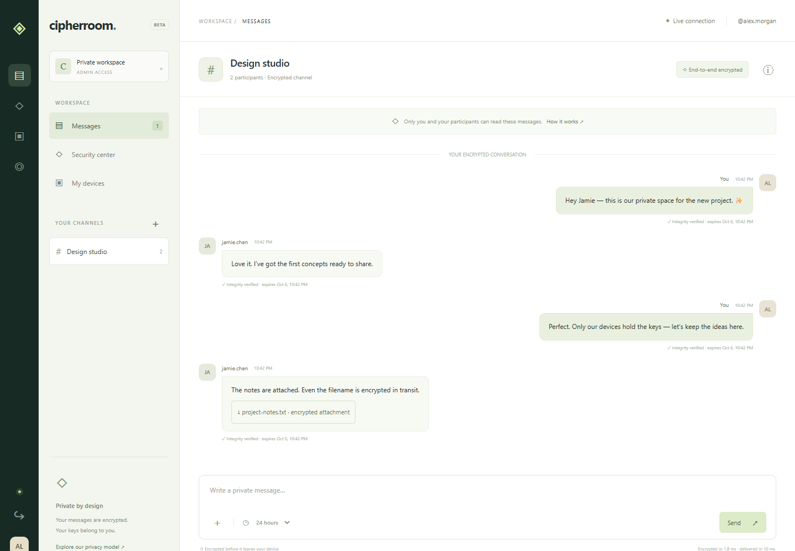

# Cipherroom

A working local Zero Trust chat prototype: browser-side end-to-end encryption, mandatory TOTP authentication, live direct/group messaging, encrypted attachments, device/session revocation, and a privacy-aware security dashboard.



## Run locally

Requires **Node.js 24+** and a current Chrome, Edge or Firefox browser.

```powershell
npm install
npm start
```

Open **http://127.0.0.1:3000**. Use this exact origin consistently: `localhost` is a different browser vault and is not the default allowed origin.

1. Select **Create account** and choose a username and a password of at least 12 characters.
2. Add the displayed setup key to a TOTP authenticator (6 digits, SHA-1, 30-second period). Enter its current code. There is no MFA bypass or hard-coded account.
3. The **first account that completes MFA enrollment becomes administrator**. Subsequent users are members. This is a local-lab bootstrap; public registration must not be exposed before the intended administrator enrolls.
4. Open a second browser or private browsing window and create another account. Separate tabs share one session cookie and are not separate users.
5. Use **+** beside Your channels, choose direct/group, name the channel and select participants. Both users can now chat live.
6. Use the channel information button to compare device fingerprints over an independent trusted channel. Pinning on first use does not prove identity.
7. Try attachments, expiration controls, Security center and My devices. **Verify identity** refreshes the five-minute step-up window for sensitive actions. Already-used TOTP codes cannot be reused; wait for the next code.

The server generates a local master key and SQLite database in ignored `data/`. Nothing is seeded into your real workspace. The screenshots and tests use isolated disposable lab accounts.

**Keep your authenticator and browser vault.** This prototype has no password/MFA recovery, key export, browser-to-browser history transfer or account restoration. A new device receives future messages only. Clearing browser storage or losing the password loses that device’s keys. An abandoned MFA enrollment holds its username for up to one hour.

## What is implemented

| Area | Working behavior |
|---|---|
| Identity | scrypt password hashes, mandatory TOTP, single-use challenges/codes, rate limits, admin/member RBAC |
| Sessions | HttpOnly SameSite=Strict cookies, CSRF + exact-origin checks, eight-hour absolute / thirty-minute idle expiration, per-session termination |
| E2EE | Per-message AES-256-GCM; ephemeral P-256 ECDH + HKDF-SHA-256 key wrapping to each trusted recipient device; ECDSA-signed envelopes |
| Key authenticity | Identity-signed device exchange-key certificates, SHA-256 fingerprints, local first-use pins, certificate/epoch rollback rejection |
| Channels | WebSocket delivery, one-to-one and groups, owner-controlled member removal, strict recipient-set validation |
| Attachments | Up to 1.5 MB, encrypted bytes and filenames inside the authenticated payload, local download |
| Retention | User-selectable 5 minute / 1 hour / 24 hour / 7 day expiry; server purge; browser display expiry; persistent replay tombstones |
| Device trust | MFA device enrollment, key epoch rotation, device/account revocation, continuous authorization on requests and live delivery |
| Monitoring | Content-free security events, warning/high severity signals, personal or admin audit views, 30-day audit retention |
| Assurance | Crypto tests, HTTP/WebSocket adversarial tests, two-user browser tests, dependency audit, focused static/secret checks, benchmarks |

**Advanced mechanism:** an implemented Zero Trust device/session model, evaluated with revocation and stale-step-up attack tests. It is MFA-based application trust, not hardware attestation or endpoint posture assessment.

## Verify and reproduce evidence

```powershell
npm ci
npm run verify
npm run test:browser
npm audit
```

`verify` checks JavaScript syntax, applies static/security policy checks, runs adversarial tests and benchmarks encryption. `test:browser` uses installed Google Chrome on Windows. On Linux/macOS first run `npx playwright install chromium` (Linux may also require browser OS dependencies). Tests bind only loopback ports **3198/3199**, create temporary databases and remove them afterward. They do not use your `data/` directory.

Evidence lives in [`evidence/`](evidence/). The tests regenerate JSON reports, TAP output and screenshots. An npm audit requires network access. CI is provided in [`.github/workflows/ci.yml`](.github/workflows/ci.yml); it has not run on GitHub because no repository has been created or pushed.

## Security scope and limits

This is an educational, unaudited protocol prototype. **It is not Signal or a production-ready secure messenger.** Message plaintext is protected from the relay/database under an honest client and verified recipient keys. A malicious server can replace the delivered JavaScript; a compromised endpoint can read plaintext. Active first-contact substitution and unauthorized new device keys require independent fingerprint verification.

Per-message ephemeral sender keys and manual recipient-key epoch deletion do **not** provide full per-message forward secrecy or post-compromise security. Compromise of a current recipient exchange key reveals recorded messages from its current epoch. Historical keys can remain in OS/browser backups. See the explicit [protocol design and forward-secrecy limitations](docs/PROTOCOL.md).

Local HTTP is for loopback development only. [Deployment instructions](docs/DEPLOYMENT.md) require HTTPS/WSS, secure cookies, controlled enrollment and an OS-protected data directory. SQLite message payloads are end-to-end ciphertext; TOTP seeds use server-side AES-GCM. Usernames, memberships, audit data and other metadata are not encrypted at the SQLite file level. Use full-disk/volume encryption for that requirement in deployment.

## Project documentation

- [Architecture, assets, data flow and measurable criteria](docs/ARCHITECTURE.md)
- [Threat model and prioritized mitigations](docs/THREAT-MODEL.md)
- [Cryptographic protocol and key lifecycle](docs/PROTOCOL.md)
- [Security tests, findings and re-test evidence](docs/ASSURANCE.md)
- [Incident response demonstration](docs/INCIDENT-RESPONSE.md)
- [Deployment and operating instructions](docs/DEPLOYMENT.md)
- [Coursework requirement mapping and collaboration checklist](docs/REQUIREMENTS.md)

No Git repository, remote, commits or team contribution history has been fabricated. Repository setup and publishing remain the next phase when requested.
