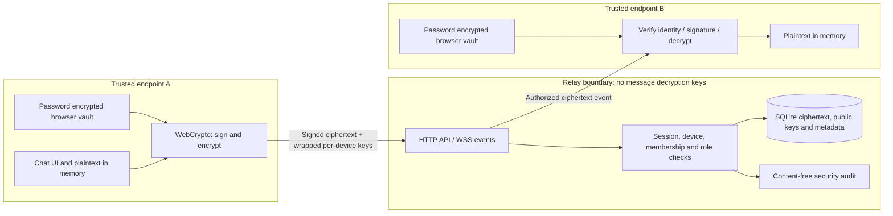

# Architecture and success criteria

## Real-world problem

A small design/research team needs confidential collaboration even if its message storage is exposed. Assets are message/attachment plaintext, private keys, account credentials, authenticator seeds, valid sessions and private membership relationships. Users include ordinary collaborators and a narrowly privileged security administrator. Administrators may review security events and revoke accounts, but are not given participant decryption keys.

## Trust boundaries / data flow

The server is trusted for authentication, membership enforcement, availability and serving the original client code. Content confidentiality does not rely on server-side message decryption. These are different trust assumptions: E2EE cannot protect a browser whose JavaScript has been replaced by the same server.

## Stack and decisions

- Node.js 24 HTTP server and built-in SQLite; a single production dependency, `ws`.
- Browser WebCrypto and plain JavaScript/CSS. No third-party scripts, fonts, analytics or service worker.
- Public cryptographic wire format in `shared/protocol.js`; the browser and server agree on canonical field order.
- SQLite prepared statements for dynamic values; explicit static route allowlist; body size bounds and strict key/envelope checks.
- WebSockets carry notifications and ciphertext. Writes use the authenticated, CSRF-protected HTTP API, giving one validation path.
- Immutable room participant additions: create a new channel to add members. Owners can remove members. New devices receive only future envelopes. Removed members lose API access to the room; saved prior content cannot be recalled.
- No typing indicators, read receipts, persistent IP address audit fields, external telemetry or plaintext search index.

## Measurable criteria

| Criterion | Measurement / target |
|---|---|
| Protected content absent from relay persistence | Integration and browser tests search message/audit records for plaintext sentinels and attachment filenames; zero occurrences |
| Authentication bypass resistance | Password without second factor yields no session; MFA replay rejected; role and origin failures return 401/403 |
| Tampering / replay | Signed-field alteration is rejected; duplicate ID yields 409, with an audit signal |
| Group authorization | Outsider cannot read devices, members or messages; stale recipient device set yields 409 |
| Revocation | Connected device/account closed immediately by explicit revocation; API access returns 401; background checks every 5 seconds |
| Key lifecycle | Rotation increments signed epoch; earlier messages unavailable with new key; subsequent messages decrypt |
| Local crypto overhead | Report median/p95 for 40 x 1 KiB messages / two recipients; target p95 encryption < 20 ms on developer machine, not a service SLA |
| Frontend | Two isolated browser users exchange text and file; mobile viewport has no horizontal overflow; no uncaught JS errors |

The database stores only the latest 100 messages per history query; no pagination exists in this prototype. Room size is capped at 21 users and message delivery at 100 devices. There is no production capacity guarantee.
